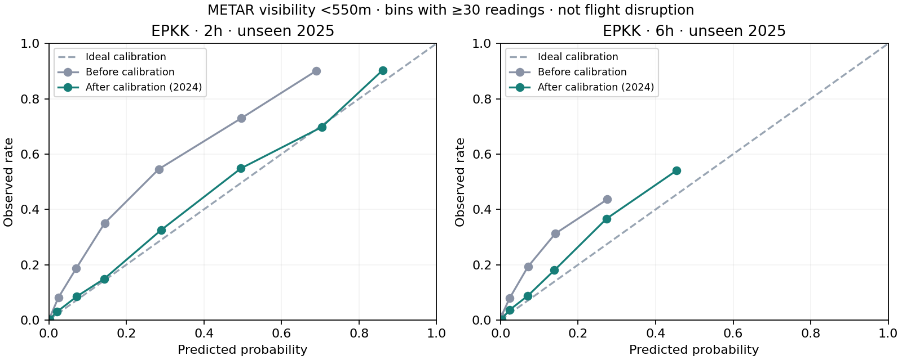

# Model: niezależny rok 2025 i kalibracja

6 października 2026. Model badawczy pozostaje **odłączony od publicznej prognozy**.

W tym eksperymencie, z jednym rokiem uczenia, najwięcej dała kalibracja prostego modelu. Rozbudowanie wejść pogorszyło wyniki. Cel to widzialność METAR <550 m za 2/6 godzin, a nie RVR, mgła jako zjawisko ani odwołanie lotu. [Kolejne iteracje](model-iterations-2026.md) poszerzają wcześniejsze sezony i sprawdzają osobno wybrane warianty na 2026; nie zastępują opisanych tutaj wyników.

## Dane i rozdzielenie okresów

Pobrano dodatkowy rok z [Iowa Environmental Mesonet](https://mesonet.agron.iastate.edu/request/download.phtml). Razem 52 596 unikalnych obserwacji EPKK z 2023–2025. Parser: 0 błędów, 1 obserwacja z brakującymi wymaganymi wejściami; 16/24 cele bez pomiaru w tolerancji ±15 min dla 2/6 h. Rzeczywista godzina odczytu weryfikującego jest zachowana.

[Protokół](model-experiment-2025-protocol.md) zapisano przed oglądaniem etykiet/wyników 2025. Klasyfikatory uczone wyłącznie na 2023; kalibratory na niezmienionych predykcjach dla 2024; końcowy test na 2025. Nie douczano klasyfikatora po kalibracji. Wycięto cele przekraczające granice lat z dodatkowym buforem 2 h. Historia wejściowa korzysta tylko z wcześniejszych pomiarów. Archiwum nie daje gwarantowanego czasu otrzymania komunikatu, więc przyjęcie dostępności od czasu obserwacji jest ograniczeniem.

| Horyzont | Uczenie 2023 | Kalibracja 2024 | Test 2025 | Odczyty <550 m w teście |
|---|---:|---:|---:|---:|
| 2 h | 17 504 | 17 552 | 17 507 | 584 |
| 6 h | 17 496 | 17 544 | 17 499 | 584 |

584 to odczyty co około pół godziny, nie 584 niezależne epizody. W 2025 Q2 nie ma dodatnich przypadków. Jeden rok nie dowodzi powtarzalności między sezonami.

## Wyniki

Brier mierzy błąd prawdopodobieństw; mniej znaczy lepiej. Spadek błędu nie oznacza takiego samego wzrostu „trafności lotów”. Poniższy model z kalibracją sigmoid był najlepszy w tej porównanej rodzinie; wskazanie go po obejrzeniu testu jest wyborem kandydata do **następnego** testu, nie kolejną niezależną walidacją.

| Metoda | Brier 2 h ↓ | Brier 6 h ↓ |
|---|---:|---:|
| Utrzymanie aktualnej widzialności | 0,02193 | 0,04343 |
| Historyczna częstość według pory dnia/miesiąca | 0,03257 | 0,03258 |
| Prosta regresja, bez kalibracji | 0,01955 | 0,02930 |
| Prosta regresja + sigmoid na 2024 | **0,01705** | **0,02797** |
| Rozszerzona regresja + sigmoid | 0,02666 | 0,03121 |
| Rozszerzony boosting + sigmoid | 0,02269 | 0,03003 |

Kalibracja zmniejsza błąd prostej regresji o ok. 13% dla 2 h i 5% dla 6 h. Względem utrzymania aktualnego pomiaru: ok. 22%/36%. Średnia prognozowana częstość dla 2 h zmienia się z 1,74% do 3,05%, przy rzeczywistej 3,34%. Dla 6 h: 1,13% do 2,49%, przy 3,34% — niedoszacowanie nadal jest widoczne.



Wykres zawiera tylko przedziały z co najmniej 30 odczytami. Pełne przedziały, również te z pojedynczymi obserwacjami, są w JSON.

Tygodniowy sparowany bootstrap: 1000 losowań, 53 bloki. Różnica Brier względem utrzymania pomiaru ma przedział 95% [-0,00817; -0,00211] dla 2 h i [-0,02415; -0,00798] dla 6 h. Ujemny wynik sprzyja modelowi. To niepewność oceny zamrożonych predykcji, bez ponownego uczenia. Dla samej poprawy kalibracji względem regresji bez kalibracji przedział 6 h obejmuje zero. Nie przeprowadzono korekty na wielokrotne porównania ani testu między niezależnymi latami.

## Co ogranicza użyteczność

- Kiedy aktualnie jest >=550 m: Brier poprawia się tylko z 0,01135 do 0,01059 dla 2 h i z 0,02247 do 0,02062 dla 6 h. Największy zysk ogólny pochodzi z sytuacji, gdy widzialność już jest słaba. To nie dowód dobrego przewidywania początku mgły.
- Przy progu alarmu 10% dla 6 h wychwycono 50% dodatnich odczytów, ale tylko 24% alarmów było prawdziwych. Przy progu 30% czułość spada do 11%. Te progi nie są ustawieniami powiadomień dla pasażerów.
- Rozszerzone cechy (lagi 1/3/6 h, udział raportów deszczu i słabej widzialności, kierunek wiatru, zachmurzenie, pora celu) nie pomogły w tym eksperymencie. Większa złożoność przy 157 dodatnich odczytach treningowych prawdopodobnie sprzyja przeuczeniu; to interpretacja, nie dowód przyczyny. Nie powtarzamy strojenia na obejrzanym 2025.
- TAF benchmark nadal niegotowy. Zapytanie [IEM TAF](https://mesonet.agron.iastate.edu/cgi-bin/request/taf.py?station=EPKK,PKK&sts=2025-01-01T00%3A00Z&ets=2026-01-01T00%3A00Z&fmt=csv) dla całego 2025 i obu identyfikatorów zwróciło 0 wierszy. Nie oznacza to, że inne archiwa nie mają danych. Bieżący collector potrafi zachować wydany TAF, ale jego regularne uruchomienie wymaga konfiguracji opisanej w DEPLOYMENT.md.

## Następna wersja

Kandydat: prosta regresja z kalibracją sigmoid. Najpierw zbierać prognozy razem z czasem wydania i porównać je z TAF-em na tych samych godzinach. Do uczenia poszerzyć wcześniejsze sezony; nowe cechy oceniać na latach rozwojowych, nie ponownie na 2025. Modelowe profile wilgotności/zachmurzenia dołączać z archiwalnych przebiegów prognoz znanych w chwili predykcji. Zachować 2026 jako kolejny test, z jawnym ograniczeniem niepełnego sezonu do czasu zebrania całego roku. Osobne prognozy nowego pogorszenia i poprawy mogą być kolejną hipotezą, ale nie zostały tu wytrenowane ani uznane za skuteczne.

## Odtworzenie i kontrola

```bash
python scripts/download-history.py --start 2023-01-01 --end 2026-01-01 --output data/metars-2023-2025.jsonl
node --import tsx scripts/prepare-training.ts data/metars-2023-2025.jsonl data/extended2h.jsonl 2 extended
node --import tsx scripts/prepare-training.ts data/metars-2023-2025.jsonl data/extended6h.jsonl 6 extended
OMP_NUM_THREADS=2 OPENBLAS_NUM_THREADS=2 python scripts/evaluate-fog-holdout.py --inputs data/extended2h.jsonl data/extended6h.jsonl --output docs/fog-holdout-2025.json
```

[Pełny artefakt](fog-holdout-2025.json): wszystkie 12 wariantów modelu i 3 baselines, wyniki kwartalne, kalibracja, progi, grupy warunków, przedziały i parametry regresji/kalibratorów. Predykcje pozostają w ignorowanym `data/holdout-predictions-{2,6}h.jsonl`. Sprawdzono hashe protokołu/danych i niezależnie przeliczono wszystkie 15 Brier z zapisanych predykcji dla obu horyzontów. Nie trzeba ponownie wykonywać eksperymentu, aby przeglądać wyniki. Kalibrację dopasowano na osobnym roku zgodnie z zasadą [rozdzielenia danych klasyfikatora i kalibratora](https://scikit-learn.org/stable/modules/calibration.html).
